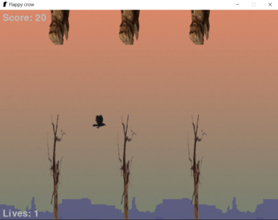

# Flappy crow pygame
Based on the game flappy bird, with changes.

Get to the end if you can, the difficulty gradually increases with the points scored.

Control mouse1 and space.

pip install -r requirements.txt
Run main.py

